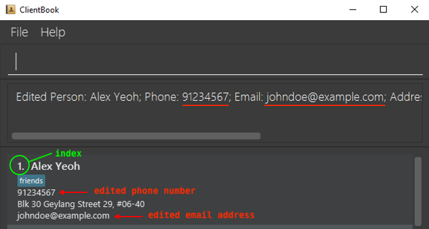
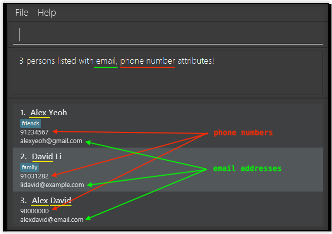

 

# ClientBook

ClientBook is an application for insurance agents to manage client contacts, optimized for use with just a keyboard,
while still offering a visual interface for ease of viewing of client contacts. The purpose of ClientBook is to help 
insurance agents who can type fast to accomplish their client management tasks faster than traditional applications.
If this is the first time that you are using an application like ClientBook, you do not have to worry, as we have included
a section [here](#how-to-use-this-user-guide) to guide you through this user guide.

 

ClientBook

## Why ClientBook?

ClientBook is designed for insurance agents who are always on the go. We understand the pain and inconvenience of having to navigate around
your screen without a mouse while you are out and about. We are also aware that you might have to remember various details about your many clients,
and that is difficult.

Thus, ClientBook is born!

Requiring **minimal interactions with your cursor**, ClientBook still allows you to complete essential contact management
tasks with our minimal yet essential set of contact management features.

## Purpose of This User Guide

The purpose of this user guide is to help you, the user get started with using ClientBook as well as to help you to get familiarised
with the features that it has to offer so that you can become comfortable with using it in your day-to-day operations as an insurance agent.

## How to Use This User Guide

If you are a new user, you can start with the [Quick Start](#quick-start) section to get ClientBook running. After that,
we have also provided an [Example Usage](#example-usage) section to help you get familiarised with ClientBook.
If you are an experienced user, we have provided a convenient [Summary of Commands](#summary-of-commands) at the end of this user guide.

To familiarise you with the user guide, here are some conventions that are used throughout the user guide.

| **Conventions** | **What it means** |
| :bulb: Tip | Tips that may be helpful to your usage of ClientBook |
| :exclamation: Caution | Cautionary information to help you to avoid mishaps |
| :information_source: Note | Information that you need to know to use ClientBook |

 
## Table of Contents 

Please use the table of contents to navigate through the user guide quickly. ClientBook's commands are grouped into 
**contact management**, 
**contact viewing**,
**shortcuts** and 
**general** commands.

* [**1.** Quick Start](#quick-start)
* [**2.** Example Usage](#example-usage)
* [**3.** Overview](#overview)
    * [**3.1** Feature Summary](#feature-summary)
    * [**3.2** What information can we store for each client contact?](#what-information-can-we-store-for-each-client-contact)
* [**4.** Feature Description](#feature-description)
    * [**4.1** Contact Management](#contact-management-features)
        * [**4.1.1** `add`: Add a client contact](#add-add-a-client-contact)
        * [**4.1.2** `edit`: Edit a client contact](#edit-edit-a-client-contact)
        * [**4.1.3** `delete`Delete a client contact](#delete-delete-a-client-contact)
        * [**4.1.4** `batch` Execute some commands in batch](#batch-execute-commands-in-batch)
        * [**4.1.5** `meet`: Schedule a meeting with a client](#meet-schedule-a-meeting-with-a-client)
    * [**4.2** Contact Viewing](#contact-viewing-features)
        * [**4.2.1** `list`: List all clients](#list-list-all-clients)
        * [**4.2.2** `find`: Search for client contacts based on keywords](#find-search-for-clients-contact-based-on-keywords)
        * [**4.2.3** `policy`: Display policies associated with a client](#policy-display-policies-associated-with-a-client)
        * [**4.2.4** `sort`: Sort the list of clients](#sort-sort-list-of-clients)
    * [**4.3** Shortcuts](#shortcuts) 
        * [**4.3.1** `addshortcut`: Add a shortcut](#addshortcut-add-shortcut)
        * [**4.3.2** `editshortcut`: Edit a shortcut](#editshortcut-edit-shortcut)
        * [**4.3.3** `deleteshortcut`: Delete a shortcut](#deleteshortcut-delete-shortcut)
        * [**4.3.4** `listshortcut`: List all shortcuts](#listshortcut-list-all-shortcuts)
        * [**4.3.5** `clearshortcut`: Clear all shortcuts](#clearshortcut-delete-all-shortcuts)
    * [**4.4** General](#general-features)  
        * [**4.4.1** `lock`: Lock ClientBook with a user-selected password](#lock-lock-clientbook-with-a-user-selected-password)
        * [**4.4.2** `unlock`: Unlock ClientBook](#unlock-unlock-clientbook)
        * [**4.4.3** `help`: Viewing help](#help-view-help)
        * [**4.4.4** `exit`: Exiting the program](#exit-exit-clientbook)
        * [**4.4.5** Keyboard commands](#keyboard-commands)
        * [**4.4.5** Saving data](#saving-data)
        * [**4.4.6** Upcoming features!](#upcoming-features-v20-and-beyond)
* [**5.** Frequently Asked Questions](#frequently-asked-questions)
  * [**5.1** Setting Up](#setting-up)
* [**6.** Summary of Commands](#summary-of-commands)
* [**7.** Glossary](#glossary)
* [**8.** Contact Us](#contact-us)

## Quick Start

The quick start section provides a tutorial which will guide you through the steps needed to get ClientBook running.

<b>Step 1.</b>

Ensure you have Java `11` or above installed in your Computer.
   * To check if you have this installed or for instructions on how to install, refer to our FAQ [here](#frequently-asked-questions).

<b>Step 2.</b>

Download the latest release of the application, `clientbook.jar`, [here](https://github.com/AY2021S2-CS2103T-W15-2/tp/releases).

<b>Step 3.</b>

Copy the downloaded file to a folder (we will be referring to this folder as the **_home folder_**) where you want to store the ClientBook application and your client information.

<b>Step 4.</b>

Double-click the downloaded `clientbook.jar` file in your home folder to start the app. The screen below should appear in a few seconds. 
   * Alternatively, for those who are tech-savvy, you can launch the application via Command Prompt in Windows or Terminal in Mac OS/Linux using the following command: `java -jar clientbook.jar`. 
   * Note how the app contains some sample data.
    
        

        
<a href="#glossary">Graphical User Interface</a> of ClientBook.

<b>Step 5.</b>

Type a command in the command box and press Enter to execute it.
   * Some example commands you can try:

   | Command | Purpose |
   | ----------- | ----------- |
   | `help` | Opens the help window with a URL to this User Guide |
   | `list` | Lists all contacts |
   | `add n/John Doe p/98765432 e/johnd@example.com a/Orchard Street, Block 123, #01-01 i/Policy_1022` | Adds a client named `John Doe` and his information to the ClientBook |
   | `delete 3` | Deletes the 3rd contact in the displayed list (i.e. deletes `Charlotte Oliveiro`) |
   | `exit` | Exits ClientBook |

Please refer to the [Feature-Description](#feature-description) section below for the full list of commands and their descriptions.

[Return to Table of Contents](#table-of-contents)

--------------------------------------------------------------------------------------------------------------------

## Example Usage

Described below are some commands that you can try to get yourself familiarised with ClientBook.

If you have followed the [Quick Start](#quick-start) guide correctly, you should see the screen below. 
For each of the commands, type them into the command box and press enter to execute the command.

<a href="#glossary">Graphical User Interface</a> of ClientBook.

[Return to Table of Contents](#table-of-contents)

<b>Step 1.</b>
 

**Try adding a new Client contact using the command** `add n/James Lee p/91234567 e/james@gmail.com a/Blk 123 Serangoon Rd t/Friend t/Colleague i/OCBC#412>www.ocbc.com/policy/412`.

That is a very long command, but it can be broken down into simple parts. We have just added a client called James Lee with the following details:
* Phone number: 91234567
* Email address: james@gmail.com
* Address: Blk 123 Serangoon Rd

We have also indicated that James is a friend as well as colleague of ours by adding the tags `Friend` and `Colleague`. Lastly,
we indicated that James has purchased a policy from us with a policy ID of OCBC#412 and that the policy's document can be found at `www.ocbc.com/policy/412`.

Now, if you scroll down the contact list, you should find James at the bottom of the list.

 

<b>Step 2.</b>

**Try editing a Client contact using the command `edit 1 p/61234567`.**

This command edits the phone number of the first client displayed in the contact list to 61234567. In this case, Alex Yeoh's
phone number in ClientBook has been changed to 61234567.

 

<b>Step 3.</b>

**Delete a Client contact using the command `delete 3`.**

This command deletes the contact of the third client displayed in the contact list.

[Return to Table of Contents](#table-of-contents)

### Conclusion
Now that you have tried out the basic commands available in ClientBook, go ahead and try out more advanced features that you can find
in the [Feature-Description](#feature-description) section below. Whenever you like, you can use the command `batch delete 1,2,3,4,5,6,7`
to delete all the sample entries and start using your very own ClientBook.

--------------------------------------------------------------------------------------------------------------------

## Overview

### Feature Summary 

| Feature | Description |
| ----------- | ----------- |
|**Contact Management**|
| [`add`](#add-add-a-client-contact) | Add a client contact |
| [`edit`](#edit-edit-a-client-contact) | Edit a client contact |
| [`delete`](#delete-delete-a-client-contact) | Delete a client contact |
| [`batch`](#batch-execute-commands-in-batch) | Execute some commands in batch |
| [`meet`](#meet-schedule-a-meeting-with-a-client) | Schedule a meeting with a client |
|**Contact Viewing**|
| [`list`](#list-list-all-clients) | List all clients |
| [`find`](#find-search-for-client-contacts-based-on-keywords) | Search for client contacts based on keywords |
| [`policy`](#policy-display-policies-associated-with-a-client) | Display policies associated with a selected client |
| [`sort`](#sort-sort-list-of-clients) | Sort the list of clients |

    

| Feature | Description |
| ----------- | ----------- |
|**Shortcuts**|
| [`addshortcut`](#addshortcut-add-shortcut) | Add a shortcut |
| [`editshortcut`](#editshortcut-edit-shortcut) | Edit a shortcut |
| [`deleteshortcut`](#deleteshortcut-delete-shortcut) | Delete a shortcut |
| [`listshortcut`](#listshortcut-list-all-shortcuts) | List all shortcuts |
| [`clearshortcut`](#clearshortcut-delete-all-shortcuts) | Clear all shortcuts |
|**General**|
| [`lock`](#lock-lock-clientbook-with-a-user-selected-password) | Lock ClientBook with a user-selected password |
| [`unlock`](#unlock-unlock-clientbook) | Unlock ClientBook |
| [`help`](#help-view-help) | View help|
| [`exit`](#exit-exit-clientbook) | Exit ClientBook |
| [Keyboard commands](#keyboard-commands) | Keyboard commands to enter command keywords quickly |
| [Saving data](#saving-data) | Save the data to a file in the home folder |

[Return to Table of Contents](#table-of-contents)

### What information can we store for each client contact?

Each client attribute such as name and address have been assigned identifiers so that you do not have to type out
the entire attribute when using ClientBook. For example, name has been abbreviated to `n`. Listed below are all the identifiers
which correspond to client attributes as well as restrictions that have to be followed when they are used as part of a command.

<table>
  <tr>
    <td> <b>Attribute</b> </td>
    <td> <b>Identifier(s)</b> </td>
    <td> <b>Notes</b> </td>
  </tr>
  <tr>
    <td> Name </td>
    <td> <code>n</code> </td>
    <td> <ul><li>Should only contain <a href="#glossary">alphanumeric</a> characters and spaces</li></ul> </td>
  </tr>
  <tr>
    <td> Phone number </td>
    <td> <code>p</code> </td>
    <td> 
        <ul><li>Should only contain numbers</li></ul>
        <ul><li>Should contain at least 3 digits</li></ul>
    </td>
  </tr>
  <tr>
    <td> Address </td>
    <td> <code>a</code> </td>
    <td> NA </td>
  </tr>
  <tr>
    <td> Email </td>
    <td> <code>e</code> </td>
    <td>
    	<ul><li><b>Format:</b> <code>name@email.com</code></li></ul>
    	<ul><li><code>name</code> and <code>email</code> parts should only contain <a href="#glossary">alphanumeric</a> characters and spaces</li></ul>
    </td>
  </tr>
  <tr>
    <td> Tag </td>
    <td> <code>t</code> </td>
    <td>
        <ul><li>Tags can be used to label your relationship with your client e.g. friend, family, classmate</li></ul>
        <ul><li>Should contain only <a href="#glossary">alphanumeric</a> characters</li></ul>
    </td>
  </tr>
  <tr>
    <td> Insurance Policies </td>
    <td> <code>i</code> </td>
    <td>
        <ul><li><b>Format:</b> <code>POLICY_ID>POLICY_URL</code> or <code>POLICY_ID</code></li></ul>
        <ul><li><b>Example:</b> <code>Prudential#155>prudential.com/155</code></li></ul>
    </td>
  </tr>
  <tr>
    <td> Meeting </td>
    <td> <code>m</code> </td>
    <td>
        <ul><li><b>Format:</b><code>DATE START_TIME END_TIME PLACE</code></li>
        <ul><li><code>DATE</code>: dd.MM.yyyy</li></ul>
        <ul><li><code>START_TIME</code> and <code>END_TIME</code>: HH:mm</li></ul>
        </ul>
        <ul><li><b>Example:</b> <code>20.05.2021 15:30 16:30 Raffles Place MRT</code></li></ul>
    </td>
  </tr>
</table>

[Return to Table of Contents](#table-of-contents)

--------------------------------------------------------------------------------------------------------------------

## Feature Description

This section describes the features that ClientBook has and how to use them. The note below explains some of the notations that are present in our features' commands.

**:information_source: Notes about the command format:** 

* **Words in UPPER_CASE are the input fields to be supplied by the user**. 
  * E.g. in `add n/NAME`, NAME is an input. For example: `add n/John Doe`.

* **Input fields in square brackets are optional**. 
  * E.g. `n/NAME [t/TAG]` can be entered as `n/John Doe t/friend` or as `n/John Doe`.

* **Input fields with …​ after them can be used multiple times**. 
  * E.g. `[t/TAG]…​` can be entered 0 or more times, `t/basic`, `t/basic t/lifeinsurance` etc.

* **Input fields can be entered in any order**. 
  * E.g. if the command specifies `n/NAME p/PHONE_NUMBER`, `p/PHONE_NUMBER n/NAME` is also acceptable.

* **Extraneous input for commands that do not take in parameters** (such as `help`, `exit` and `listshortcut`) **will be ignored**. 
  * E.g. if the command specifies `help 123`, it will be interpreted as `help`.
  
 * `INDEX` **refers to the index number shown in the displayed client list.**
  

[Return to Table of Contents](#table-of-contents)

### Contact Management Features
Contact management features are here to help you to manage your many client contacts.
This section includes basic features such as adding and removing of client contacts.

### <code>add</code>: Add a client contact

**Purpose**: Allows you to add a client as a new contact to ClientBook.

**Format**: `add n/NAME p/PHONE_NUMBER e/EMAIL a/ADDRESS [i/POLICY_ID[>POLICY_URL]]… [t/TAG]…​`

:bulb: 
**Tip**:
A client can have any number of tags and insurance policies (including 0).

**Examples**:
* Example of a client with insurance policy and URL associated with insurance policy
    * `add n/Tom Tan p/91234567 e/tomt@email.com a/Orchard i/Policy_1274>www.myinsurancecompany.com/policy_1274 t/basic`
        
* Example with no insurance policy and no tag
    * `add n/Betsy Crowe e/betsycrowe@email.com a/Kent Ridge p/61234567`
 
    

### <code>edit</code>: Edit a client contact

**Purpose**: Allows you to edit the information of an existing client contact in the ClientBook.

**Format**: `edit INDEX [n/NAME] [p/PHONE] [e/EMAIL] [a/ADDRESS] [i/POLICY_ID[>POLICY_URL]]…​ [t/TAG]…​`

* Edits the client at the specified `INDEX`.
* At least one of the optional fields must be provided.
* For fields that are allowed to be empty, specifying the identifier and leaving it empty will clear the existing information.
    * `edit 1 i/` will clear the existing policies.

:exclamation: **Caution**: Existing values will be **replaced** with the input values.

[Return to Table of Contents](#table-of-contents)

**Example**:
*  Edit the phone number and email address of the first client to be `91234567` and `johndoe@example.com` respectively.
    * **Command to enter:** `edit 1 p/91234567 e/johndoe@example.com`
    
      

### <code>delete</code>: Delete a client contact

**Purpose**: Allows you to delete a specified client's contact from ClientBook.

**Format**: `delete INDEX`

* Deletes the client at the specified `INDEX`.

**Examples**:
* Delete the second client in the currently displayed list.
	* **Command to enter:** `delete 2`
        
* To easily delete a specific client "Charlotte Chan", `delete` can be used in conjunction with [`find`](#find-search-for-client-contacts-based-on-keywords).
    * First, enter the command `find n/Charlotte Chan` to look for all clients named "Charolotte Chan"
    * After we get the filtered list, use `delete 1` to delete the client "Charlotte Chan" from ClientBook.

[Return to Table of Contents](#table-of-contents)

### <code>batch</code>: Execute commands in batch

**Purpose**: Allows you to the same `edit` or `delete` commands for multiple client contacts so that you do not have to
enter the same command multiple times.

**Format**: `batch COMMAND INDICES [ARGUMENTS]`

* Only [`edit`](#edit-edit-a-client-contact) and [`delete`](#delete-delete-a-client-contact) commands can be executed in batch.
* `INDICES` are comma-separated e.g. `1,2,3` or `1, 2, 3` and they refer to the index number shown in the displayed client list.
* There must be no repeat index in `INDICES`.
* The optional `ARGUMENTS` input is only applicable if the `COMMAND` is `edit`.
* For `edit`, you can only batch edit the following attributes:
    * phone number
    * address
    * tags
    * insurance policies

:bulb: 
**Tip**:
The same rules apply when editing clients' phone number and address!  
If a parameter is expected only once in the command, but you specified it multiple times, **only the last occurrence** of the parameter will be taken. 

**Examples**:
* Update the particulars of clients belonging to the same family and owning the same insurance policy.
    * **Command to enter:** `batch edit 1, 2, 4 a/Hougang Green t/TanFamily i/FamPol#111`
        
* Delete several client contacts at once.
    * **Command to enter:** `batch delete 1, 2, 4`

[Return to Table of Contents](#table-of-contents)

### <code>meet</code>: Schedule a meeting with a client

**Purpose**: Allows you to schedule a meeting on a particular date, start time, end time and place with a client in ClientBook.

**Format**: `meet INDEX [-ACTION] DATE START_TIME END_TIME PLACE`

* Schedules a meeting with the client at the specified `INDEX`.
* `ACTION` can be `add` to add a meeting, `delete` to delete a meeting, `clear` to clear all meetings of a client.
    * If an `ACTION` is not specified, the default `ACTION` is `add`.
* There will be a check for clashes between meetings when adding a new meeting.

**Examples**:
* Add a meeting for a specific client and there are no clashes.
    * **Command to enter:** `meet 5 -add 20.05.2021 15:00 16:00 MRT`
      
      
      
* Add a meeting for a specific client but there are clashes.
    * **Command to enter:** `meet 3 20.02.2021 12:00 15:00 KENT RIDGE MRT`
      
      

[Return to Table of Contents](#table-of-contents)
  

### Contact Viewing Features
Contact viewing features allow you to view your client contacts in different ways. For example,
you may reorder your contact list or look for specific clients.

### <code>list</code>: List all clients

**Purpose**: Shows you a list of all your clients. You may use optional identifiers in conjunction with the `-`
symbol to select which client details you want to see, so that you can have a clutter-free view of your client contacts.

**Format**: `list [-p] [-e] [-a] [-i] [-m]`

* A client's name and tags will be shown regardless of the identifiers that you specify.
* You may use one or more optional identifiers.

**Example**: 

*  Show a list of all clients with only their phone number and insurance policy information.
    * **Command to enter:** `list -p -i`
    	

[Return to Table of Contents](#table-of-contents)
  

### <code>find</code>: Search for client contacts based on keywords

**Purpose**: Allows you to find client contacts based on the attribute and keywords that you specify.
You may use optional identifiers in conjunction with the `-` symbol to limit the details shown, similar to the [`list`](#list-list-all-clients) command.

**Format**: `find IDENTIFIER/KEYWORD [& KEYWORDS]…​ [-p] [-e] [-a] [-i] [-m]`

* The `IDENTIFIER` specifies which attribute of the client you want to search for. For example, if you want to search for a client contact
  by name, use the `n` identifier.
    * For more information about the identifiers for each field, refer to [What information can we store for each client contact?](#what-information-can-we-store-for-each-client-contact).
* You may not use multiple attributes as your search criteria.
    * `find n/David a/Botanic gardens` is invalid.
* The search is **case-insensitive**. 
  * `find n/hans` is equivalent to `find n/Hans`.
* The symbol `&` between keywords allows you to search for Clients using multiple keywords.
* The **order of the keywords does not matter**.
  * `find n/alex & david` is equivalent to `find n/david & alex`
    
**Examples**:
* Find all clients whose address contains the word `geylang`.
  * **Command to enter:** `find a/geylang`
      
* Find the email and phone number of all clients whose names contain `alex` and `david` using the `&` symbol, and only display their email addresses and phone numbers.
  * `find n/alex & david -e -p`
  
    

[Return to Table of Contents](#table-of-contents)

### <code>policy</code>: Display policies associated with a client

**Purpose**: Launches a popup window for you to view all the policies associated with the selected client contact, if the selected client contact has any policies.

**Format**: `policy INDEX`

* Displays policies owned by the client at the specified `INDEX`.

**Example**:
* Display the policies associated with the second client in the currently displayed list.
    * **Command to enter:** `policy 2`  

[Return to Table of Contents](#table-of-contents)
  

### <code>sort</code>: Sort list of clients

**Purpose**: Allows you to sort the current list of clients in ClientBook so that you can view your clients in a particular order.

**Format**: `sort -IDENTIFIER -DIRECTION`

* Sorts the list of clients according to the specified `IDENTIFIER` and `DIRECTION`.
* The `IDENTIFIER` can be either `n` to sort your clients by name alphabetically or `i` to sort by number of insurance policies.
* The `DIRECTION` can be either `asc` to sort by ascending order or `des` to sort by descending order.

**Examples**:
* Sort the current list of clients by **ascending** number of insurance policies owned if you want to see which of your clients have the least policies with you.
    * **Command to enter:** `sort -i -asc`
        
* Sort the current list of clients by name in **reverse** alphabetical order.
    * **Command to enter:** `sort -n -des`

[Return to Table of Contents](#table-of-contents)
  

### Shortcuts
We understand that you might have commands that you frequently use. You may use shortcuts to abbreviate
those commands to make using ClientBook more convenient. As this feature is not commonly found in other contact management applications,
we have included the following Example Usage section to guide you through on how to use this feature. 

### Example Usage

<b>Scenario:</b>
 

You are an insurance agent and you have many client contacts stored inside of ClientBook. Your work mainly requires 
you to manage your clients' policies and you would like a way to view all your clients' policies while hiding other 
additional information (e.g. address, email, phone). You know that you can do so with the `list -i` command. However, 
you would like a faster way to do it because you have to use it frequently, so you decided to create a 
shortcut named `li` to perform the same action as `list -i`.

<b>Step 1.</b>
 

**Adding the shortcut using the command** `addshortcut sn/li sc/list -i`.

This command creates a shortcut which performs `list -i` everytime you type `li` in the command box, and it is saved to 
your shortcut library.

<b>Step 2.</b>
 

**Using the shortcut using the command** `li`.

As you have saved this shortcut in the shortcut library, you may now use `li` to perform the command `list -i` anytime 
and as many times as you want, which will save you from the hassle of having to type `list -i` everytime.

[Return to Table of Contents](#table-of-contents)
  

### <code>addshortcut</code>: Add shortcut

**Purpose**: Allows you to a command shortcut to the shortcut library.

**Format**: `addshortcut sn/SHORTCUT_NAME sc/SHORTCUT_COMMAND`

* Adds a shortcut named `SHORTCUT_NAME` to the shortcut library and assigns a valid ClientBook command `SHORTCUT_COMMAND` to it.
* The `SHORTCUT_NAME` must be [alphanumeric](#glossary) without any spacing and must not already exist the shortcut library.

**Example**:
* Add a shortcut named `li` to represent the command `list -i` (filter all client information to show policy details 
  only) in the shortcut library.
    * **Command to enter:** `addshortcut sn/li sc/list -i`

### <code>editshortcut</code>: Edit shortcut

**Purpose**: Allows you to editt the command of a shortcut in the shortcut library.

**Format**: `editshortcut sn/SHORTCUT_NAME sc/SHORTCUT_COMMAND`

* Finds a shortcut named `SHORTCUT_NAME` in the shortcut library and replaces its existing command with the provided valid ClientBook command `SHORTCUT_COMMAND`.
* The `SHORTCUT_NAME` must be [alphanumeric](#glossary) without any spacing and must exist in the shortcut library.

**Example**:
* Edit a shortcut named `ls` in the shortcut library such that it takes on a new command `list`.
    * **Command to enter:** `editshortcut sn/ls sc/list`

[Return to Table of Contents](#table-of-contents)

### <code>deleteshortcut</code>: Delete shortcut

**Purpose**: Allows you to delete a shortcut from the shortcut library.

**Format**: `deleteshortcut SHORTCUT_NAME`

* Finds a shortcut named `SHORTCUT_NAME` in the shortcut library and deletes it from the shortcut library.
* The `SHORTCUT_NAME` must be [alphanumeric](#glossary) without any spacing and must exist in the shortcut library.

**Example**:
* Delete a shortcut named `ls` in the shortcut library.
    * **Command to enter:** `deleteshortcut ls`

### <code>listshortcut</code>: List all shortcuts

**Purpose**: Allows you to list all shortcuts in the shortcut library in case you want to view the shortcuts that you have previously created.

**Format**: `listshortcut`

### <code>clearshortcut</code>: Delete all shortcuts

**Purpose**: Allows you to clear the shortcut library.

**Format**: `clearshortcut`

[Return to Table of Contents](#table-of-contents)
  

### General Features

### <code>lock</code>: Lock ClientBook with a user-selected password

**Purpose**: Allows you to lock ClientBook and ClientBook's data so that your clients' information is protected against unauthorised access.

**Format**: `lock [CURRENT_PASSWORD] [NEW_PASSWORD]`

* If ClientBook is not yet locked:
    * `CURRENT_PASSWORD` field can be omitted.
    * `NEW_PASSWORD` can also be omitted and ClientBook will attempt to lock itself using your most recently used password, if any.

* If ClientBook is already locked:
    * ClientBook verifies the current password before locking ClientBook with `NEW_PASSWORD`.

:exclamation: **Caution**: 
* After setting a password, ClientBook can only be launched through [Command Prompt](#glossary) or [Terminal](#glossary).
    * Refer to [Quick Start](#quick-start) on how to launch the application through Command Prompt or Terminal.

**Examples**:
* Lock ClientBook with password `123`.
  * **Command to enter:** `lock 123`

    

[Return to Table of Contents](#table-of-contents)

* Change ClientBook's password from `123` to `456`.
  * **Command to enter:** `lock 123 456`

        

### <code>unlock</code>: Unlock ClientBook

**Purpose**: Allows you to remove ClientBook's password lock.

**Format**: `unlock PASSWORD`

* Attempts to unlock ClientBook with `PASSWORD`.
* ClientBook's password lock is removed after executing this command. After executing this command, future launches of ClientBook will not require a password.

**Examples**:
* Unlock ClientBook with a wrong password `123`.
    * **Command to enter:** `unlock 123`

      
      
[Return to Table of Contents](#table-of-contents)

* Unlock ClientBook with the correct password `456`.
    * **Command to enter:** `unlock 456`

      

### <code>help</code>: View help

**Purpose**: Shows the URL to this user guide.

**Format**: `help`

### <code>exit</code>: Exit ClientBook

**Format**: `exit`

[Return to Table of Contents](#table-of-contents)

### Keyboard commands

**Purpose**: We note that continuously typing the same command keywords can become tiresome. Hence, we have provided 
keyboard commands which when pressed, will fill in the command keyword for you.

| Keyboard Command | Output |
| --------|------------------ |
CTRL + A | `add` |
CTRL + D | `delete` |
CTRL + E | `edit` |
CTRL + F | `find` |
CTRL + L | `list` |
CTRL + S | `sort` |

### Saving data
ClientBook saves its data file automatically after any command that changes the data.

:exclamation: **Caution**:
Please do not make changes to the data file. If the format is invalid, **all your data will be lost** at the next run.

[Return to Table of Contents](#table-of-contents)

### Upcoming features (v2.0 and beyond!)

* Archiving data files
* Customisable user interface
* Login interface
* And more!

--------------------------------------------------------------------------------------------------------------------
## Frequently Asked Questions

### Setting Up
**Q**: How do I check that [Java](#glossary) is installed on my laptop? 
**A**: Launch [Command Prompt](#glossary) or [Terminal](#glossary) and enter the following command: `java -version`.
If you get an error message (`Java command not found`), it means that Java is not installed on your laptop. 

**Q**: How do I install Java? 
**A**: Head over to the official Java website [here](https://www.oracle.com/sg/java/technologies/javase-jdk11-downloads.html), and download the appropriate installer for your system!

**Q**: How do I transfer my data to another laptop? 
**A**: Copy the entire [home folder](#quick-start) (with all the files inside) over to the other laptop! It's as simple as that!

[Return to Table of Contents](#table-of-contents)

--------------------------------------------------------------------------------------------------------------------

## Summary of Commands

| Action | Command Format |
| --------|------------------ |
|**Contact Management**|
[**Add**](#add-add-a-client-contact) | `add n/NAME p/PHONE_NUMBER e/EMAIL a/ADDRESS [i/POLICY_ID[>POLICY_URL]]… [t/TAG]…​` |
[**Edit**](#edit-edit-a-client-contact) | `edit INDEX [n/NAME] [p/PHONE_NUMBER] [e/EMAIL] [a/ADDRESS] [i/POLICY_ID[>POLICY_URL]]…​ [t/TAG]…​` |
[**Delete**](#delete-delete-a-client-contact) | `delete INDEX` |
[**Batch**](#batch-execute-commands-in-batch) | `batch COMMAND INDICES [ARGUMENTS]` |
[**Meet**](#meet-schedule-a-meeting-with-a-client) | `meet INDEX [-ACTION] DATE START_TIME END_TIME PLACE` |
|**Contact Viewing**|
[**List**](#list-list-all-clients) | `list [-p] [-e] [-a] [-i] [-m]` |
[**Find**](#find-search-for-client-contacts-based-on-keywords) | `find IDENTIFIER/KEYWORD [& KEYWORDS]…​ [-IDENTIFIER]…​` |
[**Policy**](#policy-display-policies-associated-with-a-client) | `policy INDEX` |
[**Sort**](#sort-sort-list-of-clients) | `sort -IDENTIFIER -DIRECTION` |
|**Shortcuts**|
[**Add Shortcut**](#addshortcut-add-shortcut) | `addshortcut sn/SHORTCUT_NAME sc/SHORTCUT_COMMAND` |
[**Edit Shortcut**](#editshortcut-edit-shortcut) | `editshortcut sn/SHORTCUT_NAME sc/SHORTCUT_COMMAND` |
[**Delete Shortcut**](#deleteshortcut-delete-shortcut) | `deleteshortcut SHORTCUT_NAME` |
[**List Shortcuts**](#listshortcut-list-all-shortcuts) | `listshortcut` |
[**Clear Shortcuts**](#clearshortcut-delete-all-shortcuts) | `clearshortcut` |
|**General**|
[**Lock**](#lock-lock-clientbook-with-a-user-selected-password) | `lock [CURRENT_PASSWORD] NEW_PASSWORD` |
[**Unlock**](#unlock-unlock-clientbook) | `unlock [CURRENT_PASSWORD]` |
[**Help**](#help-view-help) | `help` |
[**Exit**](#exit-exit-clientbook) | `exit` |

--------------------------------------------------------------------------------------------------------------------

## Summary of Keyboard Commands

| Keyboard Command | Output |
| --------|------------------ |
CTRL + A | `add` |
CTRL + D | `delete` |
CTRL + E | `edit` |
CTRL + F | `find` |
CTRL + L | `list` |
CTRL + S | `sort` |

[Return to Table of Contents](#table-of-contents)

--------------------------------------------------------------------------------------------------------------------

## Glossary

1. **Alphanumeric** A character or group of characters is considered alphanumeric if it contains only numbers and alphabets.

2. **Attribute** The types of information you can store in ClientBook. E.g. phone number, address, name of your clients.
   

3. **CLI** (command line interface) A text box like interface which allows a user to enter and execute commands.

4. **Command Prompt** A command line interpreter application on the Windows operating system.

5. **GUI** (graphical user interface) A form of user interface with graphical features such as icons that allows a user to interact with our program.

6. **Identifier** The alphabetical letter associated with an attribute.

7. **Java** A programming language and computing platform that is used to run ClientBook.

8. **JSON** (JavaScript Object Notation) A format for storing and transporting data.

9. **Terminal** A command line interpreter application on MacOS/Linux operating systems.

10. **UI** (user interface) An interface for a user to interact with a program.

--------------------------------------------------------------------------------------------------------------------

## Contact Us

Didn't find what you were looking for? Contact us at [clientbook@email.com](clientbook@email.com).

ClientBook is still a work in progress. We hope to be able to further improve ClientBook to suit your needs. 
Should you have any suggestions, feel free to drop us an email! 
We would love to hear from you insurance agents who are actively out and about, providing us with the best services.

[Return to Table of Contents](#table-of-contents)
